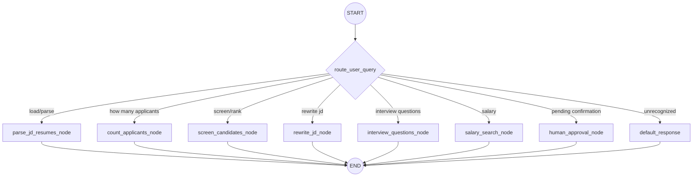

# 🤖 AI Recruitment Agent Chatbot

> A terminal-based, LangGraph-powered AI assistant that helps recruiters manage the full hiring pipeline — from Job Description posting to candidate screening, interview preparation, and salary benchmarking.

---

## 📌 Table of Contents

- [Overview](#overview)
- [Architecture](#architecture)
- [Features](#features)
- [Tech Stack](#tech-stack)
- [Project Structure](#project-structure)
- [Setup & Installation](#setup--installation)
- [Usage](#usage)
- [Workflow Graph](#workflow-graph)
- [State Schema](#state-schema)
- [Node Descriptions](#node-descriptions)
- [Benchmark Test Cases](#benchmark-test-cases)
- [Sample Session](#sample-session)
- [Environment Variables](#environment-variables)

---

## Overview

This project implements a **terminal-based recruitment agent** built with **LangGraph** (a stateful graph orchestration framework) and **Google Gemini LLMs**. It automates key recruiter workflows:

1. **JD Parsing** — Extracts structured fields (role, skills, experience) from raw job descriptions using Pydantic + Gemini structured output.
2. **Resume Loading** — Ingests 16 candidate resumes stored as `.txt` files.
3. **Applicant Counting** — Uses plain Python logic (no LLM) to count candidates.
4. **RAG-Style Screening** — Embeds resumes into a ChromaDB vector store and performs similarity search against the JD to rank candidates with match percentages.
5. **JD Rewriting** — Uses Gemini LLM to rewrite job descriptions in an engaging startup tone.
6. **Interview Question Generation** — Generates tailored interview questions grounded in both the JD and a specific candidate's resume.
7. **Salary Expectation Lookup** — Uses Tavily web search for live salary data (not RAG).
8. **Human-in-the-Loop Confirmation** — Asks the recruiter to confirm before finalizing shortlists.

---

## Architecture

```
┌─────────────────────────────────────────────────────────┐
│                   Terminal UI Loop                       │
│         (ANSI-styled interactive prompt)                │
└──────────────────────┬──────────────────────────────────┘
                       │ User query
                       ▼
┌─────────────────────────────────────────────────────────┐
│              LangGraph StateGraph                       │
│                                                         │
│  ┌─────────┐    route_user_query()    ┌──────────────┐ │
│  │  START   │ ──────────────────────► │ Conditional   │ │
│  └─────────┘                          │ Edge Router   │ │
│                                       └──────┬───────┘ │
│              ┌───────────────────────────────┼────┐    │
│              │              │                │    │    │
│              ▼              ▼                ▼    ▼    │
│  ┌──────────────┐ ┌──────────────┐ ┌────────────────┐ │
│  │ parse_jd_    │ │ count_       │ │ screen_        │ │
│  │ resumes_node │ │ applicants_  │ │ candidates_    │ │
│  │              │ │ node         │ │ node (RAG)     │ │
│  └──────┬───────┘ └──────┬───────┘ └──────┬─────────┘ │
│         │                │                │            │
│         ▼                ▼                ▼            │
│  ┌──────────────┐ ┌──────────────┐ ┌────────────────┐ │
│  │ rewrite_jd_  │ │ interview_   │ │ salary_search_ │ │
│  │ node         │ │ questions_   │ │ node (Tavily)  │ │
│  │              │ │ node         │ │                │ │
│  └──────┬───────┘ └──────┬───────┘ └──────┬─────────┘ │
│         │                │                │            │
│         │         ┌──────────────┐        │            │
│         │         │ human_       │        │            │
│         │         │ approval_    │        │            │
│         │         │ node         │        │            │
│         │         └──────┬───────┘        │            │
│         │                │                │            │
│         ▼                ▼                ▼            │
│  ┌─────────────────────────────────────────────────┐   │
│  │                      END                        │   │
│  └─────────────────────────────────────────────────┘   │
└─────────────────────────────────────────────────────────┘
```

---

## Features

| Feature | Method | LLM Used? |
|---|---|---|
| **JD Parsing** | Gemini structured output → Pydantic `ParsedJD` model | ✅ Yes |
| **Resume Loading** | `glob.glob("data/resumes/*.txt")` file I/O | ❌ No |
| **Applicant Counting** | Pure Python `len(glob.glob(...))` | ❌ No |
| **Candidate Screening** | RAG: ChromaDB + `gemini-embedding-2` vector similarity | ✅ Embeddings |
| **JD Rewriting** | Gemini `gemini-2.5-flash` prompted rewrite | ✅ Yes |
| **Interview Questions** | Gemini LLM grounded in JD + resume content | ✅ Yes |
| **Salary Lookup** | Tavily web search → Gemini summarization | ✅ Yes + Web |
| **Shortlist Confirmation** | Terminal Yes/No prompt, state-driven routing | ❌ No |
| **Rate Limit Handling** | Exponential backoff retry (429/RESOURCE_EXHAUSTED) | N/A |

---

## Tech Stack

| Component | Technology |
|---|---|
| **Language** | Python 3.13+ |
| **LLM** | Google Gemini 2.5 Flash (`gemini-2.5-flash`) |
| **Embeddings** | Google Gemini Embedding 2 (`models/gemini-embedding-2`) |
| **Graph Orchestration** | LangGraph `StateGraph` |
| **Vector Database** | ChromaDB (in-memory, via `langchain-chroma`) |
| **Structured Output** | Pydantic `BaseModel` + `llm.with_structured_output()` |
| **Web Search** | Tavily API (`tavily-python`) |
| **Environment** | `python-dotenv` for `.env` management |

---

## Project Structure

```
sttphackathon/
├── chatbot.py              # Main agent: state schema, nodes, graph, terminal UI
├── test_chatbot.py         # Integration test suite (6 benchmark tests)
├── generate_resumes.py     # Script to populate 12 additional mock resumes
├── requirements.txt        # Python dependencies
├── .env                    # API keys (GEMINI_API_KEY, TAVILY_API_KEY)
├── README.md               # This file
└── data/
    ├── jd.txt              # Job Description text file
    └── resumes/            # 16 candidate resume text files
        ├── candidate_1.txt
        ├── candidate_alice.txt
        ├── candidate_bob.txt
        ├── candidate_charlie.txt
        ├── candidate_david.txt
        ├── candidate_eva.txt
        ├── candidate_frank.txt
        ├── candidate_grace.txt
        ├── candidate_henry.txt
        ├── candidate_ivy.txt
        ├── candidate_jack.txt
        ├── candidate_karen.txt
        ├── candidate_leo.txt
        ├── candidate_mia.txt
        ├── candidate_nathan.txt
        └── candidate_olivia.txt
```

---

## Setup & Installation

### 1. Clone the repository

```bash
git clone https://github.com/Nagendrababu0206/sttphackathon.git
cd sttphackathon
```

### 2. Create and activate a virtual environment

```bash
python -m venv .venv

# Windows
.venv\Scripts\activate

# macOS/Linux
source .venv/bin/activate
```

### 3. Install dependencies

```bash
pip install -r requirements.txt
```

### 4. Configure environment variables

Create a `.env` file in the project root:

```env
GEMINI_API_KEY=your_google_gemini_api_key_here
TAVILY_API_KEY=your_tavily_api_key_here
```

> **Note:** The code automatically maps `GEMINI_API_KEY` to `GOOGLE_API_KEY` if needed.

### 5. Generate candidate resumes (if not already present)

```bash
python generate_resumes.py
```

This populates `data/resumes/` with 12 additional mock candidate profiles (16 total).

### 6. Run the chatbot

```bash
python chatbot.py
```

---

## Usage

When you launch the chatbot, it automatically:
1. Parses `data/jd.txt` using Gemini structured output
2. Preloads all 16 resumes from `data/resumes/`
3. Presents a styled terminal interface

### Supported Commands

| Command / Query | What It Does |
|---|---|
| `load` or `parse` | Reload and re-parse the JD from `data/jd.txt` |
| `how many applicants` | Count candidates using plain Python logic |
| `screen candidates` / `shortlist` | RAG-based candidate ranking with match % scores |
| `rewrite jd` | AI-powered JD rewriting with startup tone |
| `interview questions for [Name]` | Generate 3 tailored interview questions for a specific candidate |
| `salary for [Role]` | Live Tavily web search for salary expectations |
| `help` | Show all available commands |
| `exit` | Quit the chatbot |

### Confirmation Workflow

When screening produces a shortlist, the agent asks:
```
❓ Do you want to finalize this shortlist? (Yes/No)
```
- **Yes** → Shortlist is finalized and saved to state
- **No** → Shortlist is discarded, ready for next query

---

## Workflow Graph

The LangGraph `StateGraph` routes user queries to specialized nodes via a conditional edge router:



### Routing Logic

The `route_user_query()` function inspects the last user message and routes based on keyword matching:

- **`pending_confirmation == True`** → always routes to `human_approval_node`
- **Keywords like `load`, `parse`** → `parse_jd_resumes_node`
- **`how many` + `applicant/resume/candidate`** → `count_applicants_node`
- **`screen`, `rank`, `shortlist`** → `screen_candidates_node`
- **`rewrite` + `jd`** → `rewrite_jd_node`
- **`interview question(s)`, `question(s) for`** → `interview_questions_node`
- **`salary`, `compensation`, `pay scale`** → `salary_search_node`
- **Anything else** → `default_response` (out-of-scope message)

---

## State Schema

The agent maintains a shared state across all graph nodes using Python's `TypedDict`:

```python
class AgentState(TypedDict):
    messages: List[BaseMessage]            # Conversation history
    parsed_jd: Optional[Dict[str, Any]]    # Structured JD fields
    resumes: Dict[str, str]                # filename → resume text
    shortlist: List[Dict[str, Any]]        # Ranked candidates with scores
    pending_confirmation: bool             # Awaiting user confirmation?
    pending_action: Optional[str]          # Type of pending action
```

### Pydantic Model for JD Parsing

```python
class ParsedJD(BaseModel):
    role: str          # e.g., "Backend Software Engineer"
    skills: List[str]  # e.g., ["Python", "FastAPI", "Docker"]
    experience: str    # e.g., "5+ years"
```

The JD is parsed using Gemini's **structured output** capability:
```python
structured_llm = llm.with_structured_output(ParsedJD)
```

---

## Node Descriptions

### 1. `parse_jd_resumes_node`
- Reads `data/jd.txt` from disk
- Uses `structured_llm.invoke()` with Pydantic schema to extract structured fields
- Loads all `.txt` files from `data/resumes/` into state
- Falls back to raw JSON parsing if structured output fails

### 2. `count_applicants_node`
- **No LLM involved** — uses `glob.glob("data/resumes/*.txt")` + `len()`
- Returns the exact count of resume files in the folder

### 3. `screen_candidates_node` (RAG)
- Creates `Document` objects from all loaded resumes
- Initializes an in-memory ChromaDB vector store using `GoogleGenerativeAIEmbeddings(model="models/gemini-embedding-2")`
- Runs `similarity_search_with_score()` against a JD summary query
- Normalizes Chroma's L2 distance to a **match percentage** (0–100%):
  ```
  match_percentage = max(0, min(100, int((1.0 - (score / 2.0)) * 100)))
  ```
- Color-codes results: 🟢 ≥80%, 🟡 ≥60%, 🔴 <60%
- Sets `pending_confirmation = True` and `pending_action = "finalize_shortlist"`

### 4. `rewrite_jd_node`
- Sends the parsed JD fields to Gemini with a copywriting prompt
- Returns a markdown-formatted, startup-friendly rewrite

### 5. `interview_questions_node`
- Identifies the target candidate by matching the user's query against filenames and `Name:` lines in resumes
- Sends both JD requirements and the candidate's resume to Gemini
- Generates 3 tailored, behavior-based interview questions with interviewer guidelines

### 6. `salary_search_node`
- Extracts the target role from the user query (or falls back to the JD role)
- Uses **Tavily API** to perform a live web search for salary data
- Passes search results to Gemini for summarization into structured salary ranges

### 7. `human_approval_node`
- Checks for affirmative responses (yes/confirm/finalize)
- **Yes** → finalizes the shortlist in state
- **No** → clears the shortlist and resets confirmation flags

### 8. `default_response`
- Returns a helpful message listing all supported operations
- Triggered when the query doesn't match any known intent

---

## Benchmark Test Cases

The file `test_chatbot.py` contains **6 end-to-end integration tests** that exercise every node in the graph:

| Test # | Name | Query | What It Validates |
|---|---|---|---|
| 1 | **Applicant Count** | `"How many applicants are there?"` | Routes to `count_applicants_node`; returns count via pure Python (16 candidates) |
| 2 | **Candidate Screening** | `"Screen candidates"` | Routes to `screen_candidates_node`; RAG returns top 5 with match %; sets `pending_confirmation=True`, `pending_action="finalize_shortlist"` |
| 3 | **Confirm Shortlist** | `"Yes, finalize the shortlist"` | Routes to `human_approval_node`; confirms shortlist; resets `pending_confirmation=False` |
| 4 | **Interview Questions** | `"Generate interview questions for Grace Hopper"` | Routes to `interview_questions_node`; matches candidate by name; LLM generates 3 tailored questions |
| 5 | **JD Rewriting** | `"Rewrite the jd"` | Routes to `rewrite_jd_node`; LLM rewrites JD in startup tone |
| 6 | **Salary Search** | `"What is the salary expectations for a Python Developer?"` | Routes to `salary_search_node`; Tavily web search + LLM summarization |

### Running the Tests

```bash
python test_chatbot.py
```

### Expected Output

```
==================================================
Running Recruitment Agent Integration Tests...
==================================================

--- Test 1: Applicant Count ---
Recruiter: How many applicants are there?
Agent: There are 16 applicant resumes currently stored in the candidate folder.

--- Test 2: Candidate Screening ---
Recruiter: Screen candidates
Agent: === Candidate Screening Results (Top Matches) ===
  1. Charlie     -> Match Score: 77%
  2. Alice       -> Match Score: 74%
  3. Grace       -> Match Score: 72%
  ...

--- Test 3: Confirm Shortlist ---
Recruiter: Yes, finalize the shortlist
Agent: Shortlist finalized successfully!

--- Test 4: Interview Questions ---
Recruiter: Generate interview questions for Grace Hopper
Agent: === Interview Questions for Grace Hopper ===
  1. [Tailored technical question...]
  ...

--- Test 5: JD Rewriting ---
Recruiter: Rewrite the jd
Agent: === Rewritten Job Description ===
  [Engaging startup-style JD...]

--- Test 6: Salary Search ---
Recruiter: What is the salary expectations for a Python Developer?
Agent: === Salary Expectations for Python Developer ===
  [Live salary data from Tavily...]

==================================================
All Integration Tests Passed Successfully!
==================================================
```

---

## Sample Session

```
=================================================================
    🤖 WELCOME TO THE RECRUITMENT AGENT CHATBOT 💼
      Optimizing Hiring Pipelines from JD to Screening
=================================================================
⏳ Initializing database and parsing data/jd.txt...
✅ Loaded Job Description for: Backend Software Engineer
✅ Preloaded 16 candidate resumes from database.
💡 Type 'help' to see available features, or 'exit' to quit.
=================================================================

Recruiter 👤 > how many applicants do we have?

Agent 🤖 > 📊 There are 16 applicant resumes currently stored in the candidate folder.

Recruiter 👤 > screen candidates

Agent 🤖 > === Candidate Screening Results (Top Matches) ===
The following candidates were matched against JD requirements using RAG embeddings:

  1. Charlie              -> Match Score: 77% (File: candidate_charlie.txt)
  2. Alice                -> Match Score: 74% (File: candidate_alice.txt)
  3. Grace                -> Match Score: 72% (File: candidate_grace.txt)
  4. David                -> Match Score: 70% (File: candidate_david.txt)
  5. 1                    -> Match Score: 69% (File: candidate_1.txt)

❓ Do you want to finalize this shortlist? (Yes/No)

Recruiter 👤 > yes

Agent 🤖 > Shortlist finalized successfully! ✅

Recruiter 👤 > interview questions for alice

Agent 🤖 > === Interview Questions for Alice ===
  1. You mention experience with LangGraph. Can you walk us through...
  2. Given your PostgreSQL expertise, how would you design...
  3. Describe a time when you had to debug a Docker deployment...

Recruiter 👤 > salary for DevOps Engineer

Agent 🤖 > === Salary Expectations for Devops Engineer ===
  • Entry-level: $85,000 – $110,000
  • Mid-level: $120,000 – $155,000
  • Senior: $160,000 – $200,000+
  Source: Live Tavily web search.

Recruiter 👤 > exit
👋 Goodbye! Happy hiring!
```

---

## Environment Variables

| Variable | Required | Description |
|---|---|---|
| `GEMINI_API_KEY` | ✅ | Google Gemini API key (auto-mapped to `GOOGLE_API_KEY`) |
| `TAVILY_API_KEY` | ✅ | Tavily API key for live web search |

---

## Error Handling

- **Rate Limiting (429):** Both `safe_invoke()` and `parse_jd_structured()` implement exponential backoff retry (up to 3 attempts with 5s/10s/20s delays).
- **API Failures:** All LLM calls are wrapped in `safe_invoke()` which returns `[LLM Error] ...` instead of crashing.
- **Missing JD/Resumes:** Nodes check for required state before executing.
- **Windows Console:** UTF-8 encoding is reconfigured at startup; ANSI virtual terminal processing is enabled via `kernel32.SetConsoleMode`.

---

## License

This project was built for the STTP Hackathon 2026.
